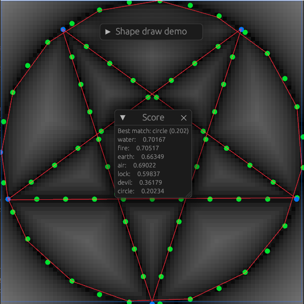

# Test demo for detection of drawn shapes

This repo serves as a test demo for detecting drawn shapes via unsinged
distance functions.

### Progress

All of the iterations on this approach were tested with no function applied
to the distance score and with a sqrt() smoothing function applied.
They were tested with DrawPaths that were drawn in a continuous manner by
holding down the mouse button continuously as well as clicking each point
into the DrawPath individually.

When left mouse button is held down, each point the mouse passes through
is added to the DrawPath object. Red line on the image.

Shapes are defined as a vector of USDFs, a fundamental building unit.
USDF can either be a circular arc (`CircleSegment` in code) or a line segment
(`LineSegment` in code). USDFs are an unsigned distance function that takes
in a point and returns the distance of this point to the closest part of the
USDF.

Shapes give a score to a point by determining the distance of the point
from each of the USDFs and returning the least of those values.
Grayscale image represents this by sampling points on the plane and
determining their score.

DrawPaths give a score to a shape by averaging the scores of all the points
the DrawPath object comprises of.
Scores for all predefined shapes are calculated and the shape with the
lowest score is chosen as the detected shape.
This is shown in the score window on the image.

Shapes that were built on other shapes would score the same as the shapes
they were built on, so a reverse score calculation was put in place by stepping
through each USDF by an even amount, determining the distance of this stepped
USDF point (represented by green and blue dots on the image) to each point of
the DrawPath, finding the minimum value, and averaging these values for each
point stepped USDF point in a shape. This didn't work.

### Plans to mitigate flaws:

Flaw:
- The detected shape rarely matches with what is drawn
- There is not way to detect whether no shape has matched

Proposed solution:
- Introduce a variable smoothing function.
  This could allow for more leniency when drawing shapes while still requiring
  the basic shape to be detected. It could also allow to set a score threshold
  a shape would have to be under in order to "be detected".
- The effects of this on the reverse scoring function have not been considered yet.
- Restructure the code to support this change.

Flaw:
- Not all shapes and curves can be represented by circle and line segments

Proposed solution:
- Bezier curves could provide a solution to this but are computationally expensive
- Determine an even step-through a Bezier curve - seemingly easy
- Determine distance from point to bezier curve - iterative approach - expensive

Flaw:
- Inputs to egui are still registered by macroquad

Proposed solution
- Prevent macroquad from interacting when egui consumes mouse (or keyboard) inputs
- Implement this for all future mq-wbg-template projects
- https://github.com/emilk/egui/discussions/495

Flaw:
- Circle shape always seems to have abnormally high score.

Proposed solution:
- Investigate for implementation errors if the problem persists

## Instructions and dependencies:

All scripts listed below are compatible with default Windows installation of
PowerShell (v6+ not required) as well as bash for Linux (scripts are polyglot)

(The bash portion of the polyglot scripts is untested, use with caution
and please report back with results or a pull request)

### [`setup.ps1`](setup.ps1)
This script installs `wasm-bindgen-cli` (version 0.2.84), `basic-http-server`
and adds `wasm32-unknown-unknown` to possible compilation targets.
Note that this version of `wasm-bindgen-cli` is required for the pipeline
defined in this repository.

(This is only necessary to run once on a single computer as the effects
of this script are global.)

### [`build.ps1`](build.ps1)
This script builds the project for the `wasm32-unknown-unknown` target in
`--release` mode, generates WASM bindings, and patches the generated JavaScript
file. It also moves the relevant files to their appropriate directories
in preparation for running the project on a local server or on GitHub Pages.

### [`run.ps1`](run.ps1)
This script hosts the built project on a local `basic-http-server`
server and opens a browser at its location.

(One does not need to restart the server after building the project again,
reloading the webpage in the browser is sufficent.)

(This is necessary over just opening the [`index.html`](index.html)
file in your browser so that the required resources load properly.)

## Sources:
### JS patching scripts:
- https://gist.github.com/tgolsson/d78f7887a8542f3fd6f125070e5e22d6
- https://gist.github.com/nobbele/0d932a993786ed081632254fb6b01e25
- https://gist.github.com/olefasting/15ae263da4cf1ba308ce55c15c9b221b
- https://iquilezles.org/articles/distfunctions2d/
- https://stackoverflow.com/questions/12234574/calculating-if-an-angle-is-between-two-angles

## License

Licensed under either of

- Apache License, Version 2.0
  ([LICENSE-APACHE](LICENSE-APACHE) or https://www.apache.org/licenses/LICENSE-2.0)
- MIT license
  ([LICENSE-MIT](LICENSE-MIT) or https://opensource.org/licenses/MIT)

at your option.

## Contribution

Unless you explicitly state otherwise, any contribution intentionally submitted
for inclusion in the work by you, as defined in the Apache-2.0 license, shall be
dual licensed as above, without any additional terms or conditions.
